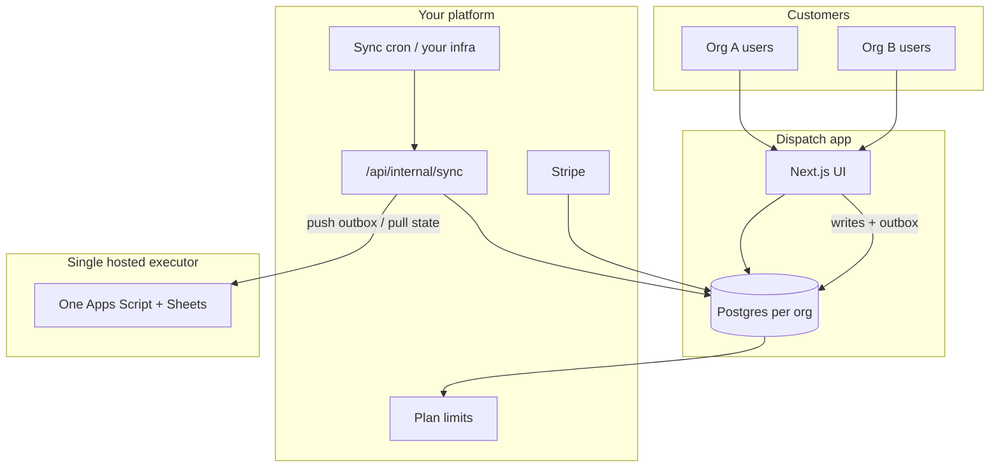

# Phase C — Platform (auth, tenancy, billing)

Planning doc for later. **Not implemented yet.** Finish Phase B improvements and sync reliability before starting here.

Previous phases: [PHASE_A.md](./PHASE_A.md) · [PHASE_B.md](./PHASE_B.md) · Pricing: [PLANS.md](./PLANS.md)

---

## Goal

Turn Dispatch from a single hidden workspace (`__system__`) into a **multi-tenant SaaS**:

- Users sign in and belong to **organizations**
- All product data scoped by `organizationId` in **Postgres**
- **Plans** enforce limits (+ eventually usage / completions per month — see [PLANS.md](./PLANS.md))
- **Billing** via Stripe using `Plan` / `OrganizationSubscription`
- **Hosted execution** — customers do **not** deploy Apps Script; everyone runs on **your one** platform Script + sheet backend (same UX promise as Trigger.dev: “nothing to deploy”)

Sync: your infra calls `POST /api/internal/sync` (per org or all orgs) with auth keys — see C5.

---

## Execution model (read this first)

| | Phase A/B today | Phase C target |
|--|-----------------|----------------|
| Who owns Apps Script? | **You** (one deployment) | **You** (unchanged) |
| Per customer Script URL? | **No** | **No** — not a product feature |
| User experience | Like cloud jobs | Like cloud jobs — queue, run, history |
| Isolation | Mostly `__system__` org | **Every** job/action/queue row tagged `organizationId` in DB **and** in Sheets/executor payloads |
| Capacity | Shared Google quotas | Plan limits + optional global platform caps |

`ExecutionBackend` in Prisma: store **platform** config (shared `webAppUrl`, health, last error) — not “customer pastes URL.” Optional one row per org only if you need per-org metadata, same URL for all.

**Before opening signup:** implement tenant scoping in `apps-script/Code.gs` (and sheet layout if needed) so Org A cannot read Org B’s jobs.

---

## Prerequisites (do before Phase C)

- [ ] Phase B stable: `SYNC_MODE=async`, worker calls `/api/internal/sync` on a schedule
- [ ] Push/pull reliable (outbox failures monitored, pull shows completions in History)
- [ ] Product UX polish on current routes
- [ ] **Hosted tenancy:** `organizationId` passed on every executor action + enforced in Apps Script / sheets
- [ ] **Platform capacity:** understand Google Script limits vs expected concurrent orgs (see [PLANS.md](./PLANS.md) cost section)
- [ ] Optional: completion webhook from Apps Script → faster pull than poll-only

---

## What already exists in the schema

| Model | Today | Phase C |
|--------|--------|---------|
| `Plan` | Seeded (`free`, `pro`, `enterprise`) | Enforced limits + Stripe |
| `Organization` | Hidden `__system__` only | User-created workspaces |
| `User` | Seed system user only | Real users from auth |
| `OrganizationMember` | Hidden membership | Invite / roles |
| `OrganizationSubscription` | Seed on system org | Stripe lifecycle |
| `ExecutionBackend` | Can point at platform URL | **Platform** config only; not customer BYO |
| `Pipeline`, `Action`, `Job`, … | `organizationId` column exists | All reads/writes scoped in services |

Services today use `getDefaultOrganization()` — Phase C replaces with session-based active org.

---

## Architecture (target)



---

## Workstreams

### C1 — Authentication

| Provider | Pros |
|----------|------|
| Clerk | Orgs + switcher OOTB |
| NextAuth | Full control |
| Supabase Auth | Same DB vendor |

**Deliverables:** sign-in/up, session in server actions, `User` upsert, middleware gate on `(app)/`, keep `__system__` for admin/migration only.

---

### C2 — Organization context

**Deliverables:**

- `getActiveOrganization(session)` — replace `getDefaultOrganization()` in all services
- Org switcher, create org (name, slug) → `Organization` + `OrganizationMember` (owner) + `OrganizationSubscription` (free plan)
- **Do not** ask new users to “connect Apps Script” — execution is already hosted
- Optional: create `ExecutionBackend` row per org with **same** `webAppUrl` as platform env (for metadata only)
- Membership check on every `organizationId` from client

**Roles:** `owner` (billing, delete org), `admin` (CRUD), `member` (enqueue/view).

---

### C3 — Plan limits (+ usage later)

See [PLANS.md](./PLANS.md) for counts and Trigger comparison.

**Phase C minimum:**

- Enforce `maxPipelines`, `maxActions`, `maxActiveJobs`, `maxSchedules`, `maxMembers`, `retentionDays`
- `lib/plans/enforce.ts` + UI usage meters + upgrade CTA

**Phase C+ (hosted economics):**

- Track **job completions / month** per org (like Trigger “included usage”)
- Optional global cap on concurrent active jobs **across all tenants** on shared Script

---

### C4 — Billing (Stripe)

- Customer ↔ `Organization.externalCustomerId`
- Subscription ↔ `OrganizationSubscription` + `Plan.slug`
- Checkout / portal (owner only)
- Webhook updates status / plan / period

---

### C5 — Sync auth (your infra)

Today: one `INTERNAL_API_SECRET` for all sync.

**Target:**

- Platform cron: `POST /api/internal/sync` with global secret, loop orgs with pending outbox / pull (or `organizationId` query param)
- Optional per-org API keys for isolated sync runs (`sync:push`, `sync:pull`) — for debugging or sharded workers
- Not related to customer Apps Script — customers never sync themselves

---

### C6 — Hosted executor hardening (critical)

| Task | Why |
|------|-----|
| Pass `organizationId` on all `callExecutor` payloads | Push/pull only that tenant’s rows |
| Scope Apps Script handlers by org | Prevent cross-tenant reads/writes on shared sheet |
| Sheet strategy | One spreadsheet with org column **or** partition tabs/queues per org — decide and document |
| Rate / fairness | Per-org active job limits protect shared Script |
| Admin-only env | `APPS_SCRIPT_WEB_APP_URL` — single platform deployment |

**Later:** `ExecutionBackendType.bullmq` if Google quotas block growth.

---

### C7 — UI / product surface

| Area | Changes |
|------|---------|
| Sidebar | Org switcher, user menu, sign out |
| Settings | Profile, **billing**, plan usage, API keys (internal — optional) |
| Onboarding | Sign up → create org → first pipeline → first action → enqueue job (**no Script URL step**) |
| Marketing | “Hosted jobs — nothing to deploy” |

Remove from plans: “paste your web app URL” in customer-facing settings.

---

## Suggested implementation order

1. **C6** Tenant isolation in executor + services (blocker for real multi-tenant)  
2. **C1** Auth  
3. **C2** Active org everywhere  
4. **C3** Plan limits  
5. **C5** Sync auth (platform worker)  
6. **C4** Stripe  
7. **C7** Onboarding + polish  

Billing after limits and isolation work.

---

## Out of scope for Phase C

- Per-customer Apps Script deployments (BYO executor)
- Public customer REST API
- SSO / SAML (enterprise later)
- Replacing Script with BullMQ (later; schema ready)

---

## Environment checklist

```env
# Platform (one Script for all customers)
APPS_SCRIPT_WEB_APP_URL=
SYNC_MODE=async
INTERNAL_API_SECRET=          # your sync worker

DATABASE_URL=
DIRECT_URL=

# Auth (example)
NEXT_PUBLIC_CLERK_PUBLISHABLE_KEY=
CLERK_SECRET_KEY=

# Billing
STRIPE_SECRET_KEY=
STRIPE_WEBHOOK_SECRET=
NEXT_PUBLIC_STRIPE_PUBLISHABLE_KEY=
```

---

## Success criteria

- [ ] New user signs up, creates org, uses app — never sees `__system__` or Script setup
- [ ] Org A cannot see or run Org B’s jobs (DB + executor)
- [ ] All jobs run on **platform** Apps Script only
- [ ] Plan limits block over-cap creates; upgrade path works
- [ ] Platform sync worker pushes outbox and pulls completions per org
- [ ] Shared Script stays within acceptable quota at expected Free/Pro mix ([PLANS.md](./PLANS.md))

---

## Related improvements (do now, before Phase C)

- Sync reliability + outbox failure visibility  
- Apps Script: `organizationId` on addJob / row filters (start C6 early)  
- UI: “Pending sync to sheet” when async  
- [PLANS.md](./PLANS.md) + README: hosted executor described correctly  

When Phase C starts, complete prerequisites and **C6** before public signup.
